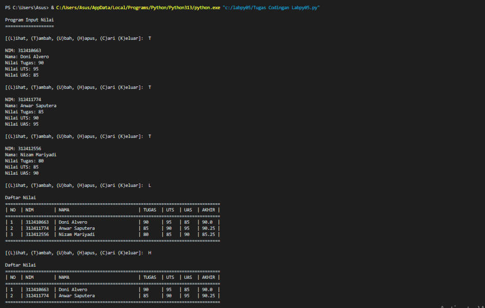
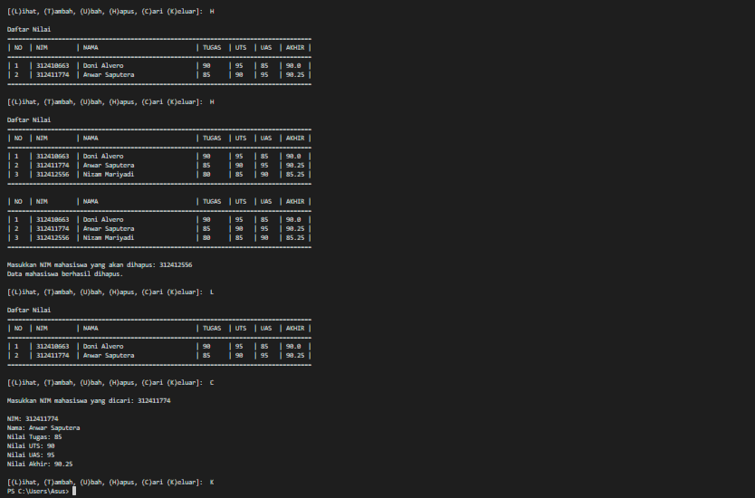

# labpy_05
Nama : Doni Alvero
NIM : 312410663
Kelas : TI.24.A.5
Mata Kuliah : Bahasa Pemrograman

1. Header Program
print("\nProgram Input Nilai")
print("===================")
Penjelasan:
Bagian ini mencetak judul program yang menunjukkan bahwa program ini digunakan untuk menginput nilai mahasiswa.
Menggunakan print untuk menampilkan teks di konsol, memberikan konteks kepada pengguna tentang apa yang akan dilakukan oleh program.
2. Kelas Student
class Student:
    def __init__(self, nim, nama, tugas, uts, uas):
        self.nim = nim
        self.nama = nama
        self.tugas = tugas
        self.uts = uts
        self.uas = uas
        self.akhir = self.calculate_final_grade()

    def calculate_final_grade(self):
        return round((self.tugas * 0.3) + (self.uts * 0.35) + (self.uas * 0.35), 2)
Penjelasan:
Kelas Student digunakan untuk menyimpan informasi tentang mahasiswa.
Atribut:
nim: Nomor Induk Mahasiswa.
nama: Nama mahasiswa.
tugas, uts, uas: Nilai untuk tugas, UTS, dan UAS.
akhir: Nilai akhir yang dihitung berdasarkan bobot yang ditentukan.
Metode:
calculate_final_grade: Menghitung nilai akhir berdasarkan bobot (tugas 30%, UTS 35%, UAS 35%) dan mengembalikannya dalam format angka bulat dua desimal.
3. Fungsi Menampilkan Menu
def display_menu():
    print("\n[(L)ihat, (T)ambah, (U)bah, (H)apus, (C)ari (K)eluar]: ", end=' ')
Penjelasan:

Fungsi ini menampilkan menu pilihan kepada pengguna untuk melakukan berbagai aksi terkait data mahasiswa.
Menggunakan print untuk meminta input dari pengguna dan memberikan opsi yang tersedia.
4. Fungsi Menampilkan Daftar Mahasiswa
def display_students(students):
    print("\nDaftar Nilai")
    print("=" * 84)
    print(f"| {'NO':<3} | {'NIM':<10} | {'NAMA':<30} | {'TUGAS':<6} | {'UTS':<4} | {'UAS':<4} | {'AKHIR':<5} |")
    print("=" * 84)
    if not students:
        print(f"| {'TIDAK ADA DATA':^80} |")
    else:
        for i, student in enumerate(students, start=1):
            print(f"| {i:<3} | {student.nim:<10} | {student.nama:<30} | {student.tugas:<6} | {student.uts:<4} | {student.uas:<4} | {student.akhir:<5} |")
    print("=" * 84)
Penjelasan:

Fungsi ini menampilkan daftar nilai mahasiswa dalam format tabel.
Jika tidak ada data mahasiswa, fungsi akan menampilkan pesan "TIDAK ADA DATA".
Menggunakan enumerate untuk mendapatkan indeks mahasiswa saat mencetak daftar.
5. Fungsi Mencari Indeks Mahasiswa
def find_student_index(students, nim):
    for index, student in enumerate(students):
        if student.nim == nim:
            return index
    return None
Penjelasan:
Fungsi ini mencari indeks mahasiswa berdasarkan NIM yang diberikan.
Mengembalikan indeks mahasiswa jika ditemukan, atau None jika tidak ditemukan.
6. Fungsi Utama
def main():
    students = []
    while True:
        display_menu()
        choice = input().lower()
        if choice == 't':
            nim = input("\nNIM: ")
            nama = input("Nama: ")
            tugas = int(input("Nilai Tugas: "))
            uts = int(input("Nilai UTS: "))
            uas = int(input("Nilai UAS: "))
            students.append(Student(nim, nama, tugas, uts, uas))
        elif choice == 'l':
            display_students(students)
        elif choice == 'u':
            display_students(students)
            nim = input("\nMasukkan NIM mahasiswa yang akan diubah: ")
            index = find_student_index(students, nim)
            if index is not None:
                print("Data baru
