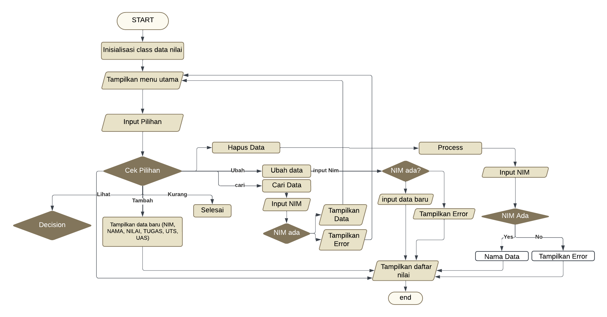

# labpy_05
Nama : Doni Alvero 

NIM : 312410663 

Kelas : TI.24.A.5 

Mata Kuliah : Bahasa Pemrograman 

## Flowchart

## Kode Program 

### Penjelasan Program
1. Kelas Student:
   - Kelas ini menyimpan informasi tentang mahasiswa, seperti NIM, nama, nilai tugas, UTS, dan UAS.
   - Metode calculate_final_grade menghitung nilai akhir mahasiswa berdasarkan bobot yang diberikan (30% tugas, 35% UTS, dan 35% UAS).
2. Fungsi display_menu:
   - Fungsi ini menampilkan menu pilihan kepada pengguna dengan opsi untuk melihat, menambah, mengubah, menghapus, mencari data, atau keluar.
3. Fungsi display_students:
   - Fungsi ini menampilkan daftar mahasiswa beserta nilai-nilainya dalam format tabel.
4. Fungsi find_student_index:
   - Fungsi ini mencari indeks mahasiswa dalam daftar berdasarkan NIM yang diberikan. Jika ditemukan, mengembalikan indeks tersebut; jika tidak, mengembalikan None.
5. Fungsi main:
   - Fungsi utama yang menjalankan program.
   - Di dalamnya terdapat loop yang terus berjalan menampilkan menu dan memproses pilihan pengguna:
     - t: Menambah data mahasiswa baru.
     - l: Menampilkan daftar mahasiswa.
     - u: Mengubah data mahasiswa berdasarkan NIM.
     - h: Menghapus data mahasiswa berdasarkan NIM.
     - c: Mencari dan menampilkan data mahasiswa berdasarkan NIM.
     - k: Keluar dari program.

## Ouput Program

